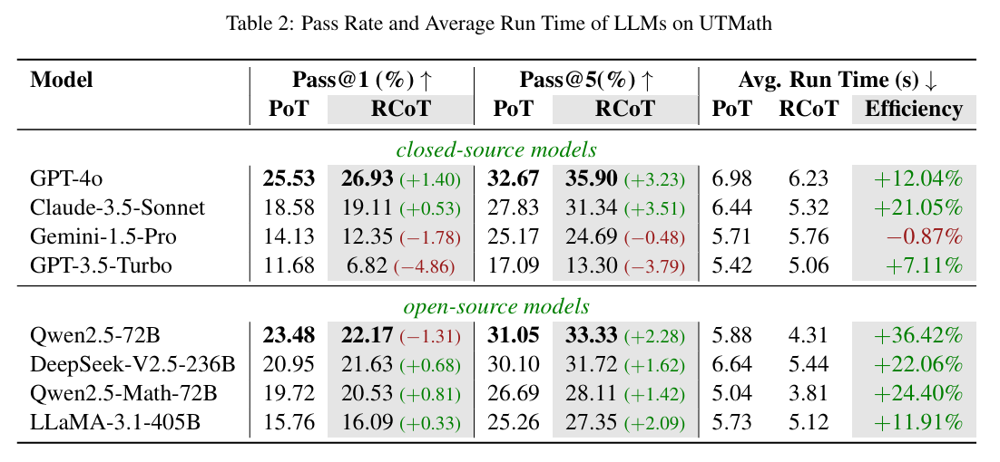
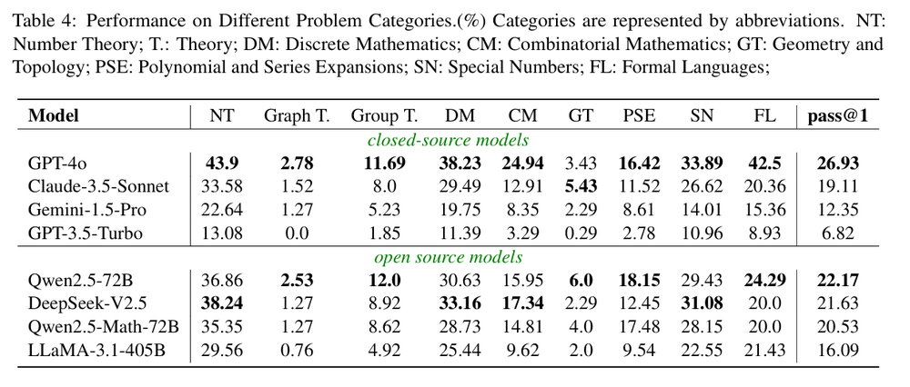

<p align="center">
    <a href="https://arxiv.org/abs/2411.07240">
        
    </a>
    <a href="https://github.com/UTMathGroup/UTMath/tree/main">
        
    </a>
    <a href="https://huggingface.co/datasets/Leonardoby/UTMath">
        
    </a>
</p>


## 📄 UTMath
*UTMath is a rigorous and expansive benchmark designed to evaluate the mathematical reasoning abilities of Large Language Models (LLMs). Based on sequences and inspired by the Online Encyclopedia of Integer Sequences ([OEIS](https://oeis.org/wiki/Welcome)), UTMath encompasses a diverse set of 1,053 problems across 9 distinct mathematical domains. This provides a comprehensive assessment of LLMs' capabilities. With over 68 test cases per problem, UTMath ensures a thorough evaluation, emphasizing both the accuracy and reliability of the results. Drawing from unit testing methodologies in software development, UTMath’s innovative framework enables a detailed analysis of how well LLMs adapt and reason across a broad range of mathematical topics.*

*The Reasoning-to-Coding of Thoughts (RCoT) approach complements the UTMath Benchmark by encouraging LLMs to engage in explicit reasoning prior to generating code. This approach fosters the development of more sophisticated and logically coherent solutions, leading to improved overall performance in mathematical problem-solving.*


In `data/oeis_problem.jsonl`, you'll find all 1053 problems from the UTMath benchmark, covering 9 mathematical domains. Each problem includes over 68 test cases.

## 🥇 Leader board
*Here, we consider the closed-source models, i.e., GPT-3.5-Turbo/GPT-4o from OpenAI, Claude-3.5-Sonnet, Gemini-1.5-Pro, as well as the open-source models, i.e., LLaMA-3.1, Qwen2.5, Qwen2.5-Math, DeepSeek-V2.5. The metric pass@1 is calculated as the average result over 5 run times. We run all evaluations in a laptop with CPU Intel(R) Core(TM) i7-10750H CPU @ 2.60GHz.*



## 😎 Some interesting findings
We conducted a comprehensive study with 8 LLMs. Some of our key findings are summarized as follows:
- The best model, GPT-4o, only solves 26.93\% problem in our benchmark, demonstrate the difficulty of our benchmarks.
- Modern LLMs perform poorly in Graph Theory, Group Theory, Geometry and Topology.


- With RCoT, 7 of 8 evaluated LLMs generated more efficient solutions, with most models achieving higher scores.
- RCoT can significantly improve the pass@k performance of LLMs. 


- The quality of reasoning significantly impacts the accuracy and efficiency of the model's final solution.


We hope our findings contribute to a deeper understanding of current reasoning ability of LLMs and the further development of models.

## ✍️ RCoT Inference
We have preconfigured the environment to use OpenAI's API to call GPT-4o and apply the RCoT method for reasoning. After setting up your API key in the environment, you can enter the following command:
```python
python get_rcot_response.py --problem_path=data/utmath_problem.jsonl --save_path={your_save_file_path} --model_name={your_llm_name}
```
For example, after setting up the OpenAI API, you can use the following Python code to call GPT-4o and perform reasoning using the RCoT method.
```python
python get_rcot_response.py --problem_path=data/utmath_problem.jsonl --save_path=data/sample_exapmle/gpt-4o_test.jsonl --model_name=gpt-4o-2024-08-06
```

## 📊 UTMath_Evaluation

You can use this sample as a reference for evaluating on UTMath. Please use the following code:
```python
python utmath_eval/utmath_evaluator.py  --problem_file=data/utmath_problem.jsonl --sample_file={your_sample_file_path}
```

For example, you can directly use our response sample:
The file `data/sample_example/gpt-4o_sample.jsonl` contains responses generated using the RCoT method with GPT-4o on the UTMath benchmark. This sample includes responses to all 1053 problems.
```python
python utmath_eval/utmath_evaluator.py  --problem_file=data/utmath_problem.jsonl --sample_file=data/sample_example/gpt-4o_sample.jsonl

# --with_extra_data=True represents testing both easy and hard cases
# --with_extra_data=None represents testing only easy cases
```

## 👀 Furthermore
*Additionally, we are releasing not only the UTMath benchmark but also the UTMath-Train dataset, consisting of over 70,000 problem-solving samples. This dataset is designed to support the community in further advancing research on mathematical reasoning and improving LLM performance in this domain.*

## 💬 Citation
If you find our work interesting and meaningful, welcome to give a 🌟 to our repo and cite our paper.
```
@misc{yang2024utmathmathevaluationunit,
      title={UTMath: Math Evaluation with Unit Test via Reasoning-to-Coding Thoughts}, 
      author={Bo Yang and Qingping Yang and Runtao Liu},
      year={2024},
      eprint={2411.07240},
      archivePrefix={arXiv},
      primaryClass={cs.CL},
      url={https://arxiv.org/abs/2411.07240}, 
}
```

# 🥰 Acknowledgement
- We sincerely thank the [OEIS](https://oeis.org/wiki/Welcome) for its tireless efforts and contributions to the advancement of mathematics and computer science.
- We are also grateful to [HumanEval](https://github.com/openai/human-eval) for providing valuable code resources. 
