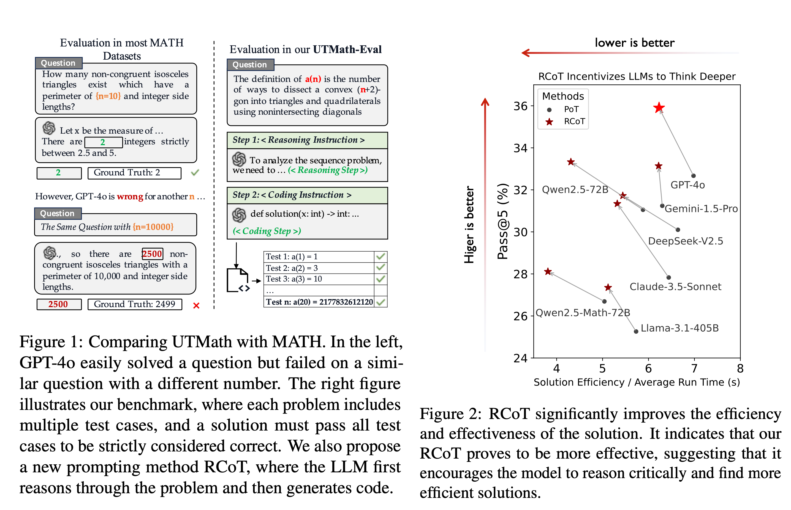
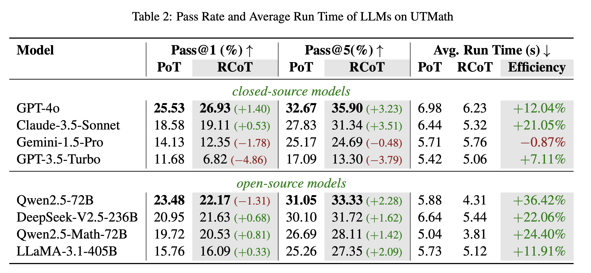
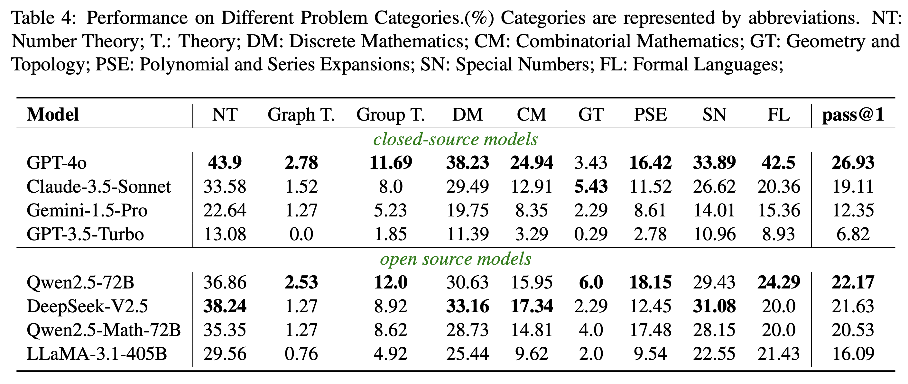
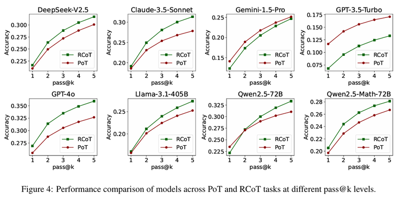
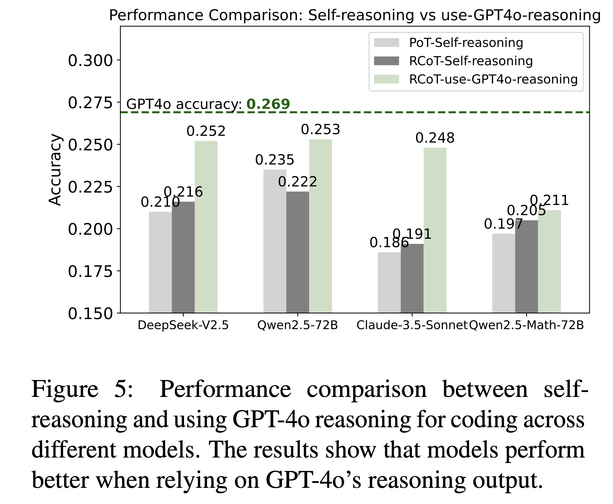

<p align="center">
    <a href="https://arxiv.org/abs/2411.07240">
        
    </a>
    <a href="https://github.com/UTMathGroup/UTMath">
        
    </a>
    <a href="https://huggingface.co/datasets/UTMath/UTMath">
        
    </a>
    <a href="https://huggingface.co/datasets/UTMath/UTMath_Train">
        
    </a>
    <a href="https://huggingface.co/datasets/UTMath/UTMath_Train">
        
    </a> 
</p>


## 📄 UTMath
*UTMath: Math Evaluation with **Unit Test** via Reasoning-to-Coding Thoughts*

*UTMath is a rigorous and expansive benchmark designed to evaluate the mathematical reasoning abilities of Large Language Models (LLMs), with an average of 68 test cases per problem to ensure that the model **truly solves the problem** rather than simply memorizing the answers.*
<ul>
    <li><b>⚡️Multiple Case Validation</b>: Instead of using single cases that can be memorized, our questions are sequence-based, allowing numerous cases for validating true understanding.</li>
    <li><b>🔧True Reasoning Evaluation</b>: Hard cases and runtime metrics help filter memorization and compare solution efficiency, precisely assessing reasoning abilities.</li>
</ul>

*The Reasoning-to-Coding of Thoughts (RCoT) approach complements the UTMath Benchmark by encouraging LLMs to engage in explicit reasoning prior to generating code.RCoT significantly improves the efficiency and effectiveness of the solution.*
<ul>
    <li><b>🏆Code Output Evaluation</b>: We require LLMs to output code, focusing on reasoning rather than direct answers, to better reflect their reasoning skills.</li>
    <li><b>🌐Observation of Reasoning Process</b>: By mandating code implementation, we can observe and validate the LLM's reasoning process, not just the final answer.</li>
</ul>




In `data/oeis_problem.jsonl`, you'll find all 1053 problems from the UTMath benchmark, covering 9 mathematical domains. Each problem includes over 68 test cases.

## 📊 Evaluating on UTMath

You can use this sample as a reference for evaluating on UTMath. Please use the following code:
```python
python utmath_eval/utmath_evaluator.py  --problem_file=data/utmath_problem.jsonl --sample_file={your_sample_file_path}
```

For example, you can directly use our response sample:
The file `data/sample_example/gpt-4o_sample.jsonl` contains responses generated using the RCoT method with GPT-4o on the UTMath benchmark. This sample includes responses to all 1053 problems.
```python
python utmath_eval/utmath_evaluator.py  --problem_file=data/utmath_problem.jsonl --sample_file=data/sample_example/gpt-4o_sample.jsonl

# --with_extra_data=True represents testing both easy and hard cases
# --with_extra_data=None represents testing only easy cases
```

## ✍️ RCoT Inference
We have preconfigured the environment to use OpenAI's API to call GPT-4o and apply the RCoT method for reasoning. After setting up your API key in the environment, you can enter the following command:
```python
python get_rcot_response.py --problem_path=data/utmath_problem.jsonl --save_path={your_save_file_path} --model_name={your_llm_name}
```
For example, after setting up the OpenAI API, you can use the following Python code to call GPT-4o and perform reasoning using the RCoT method.
```python
python get_rcot_response.py --problem_path=data/utmath_problem.jsonl --save_path=data/sample_exapmle/gpt-4o_test.jsonl --model_name=gpt-4o-2024-08-06
```

## 💬 Citation
If you find our work interesting and meaningful, welcome to give a 🌟 to our repo and cite our paper.
```
@article{yang2024utmath,
  title={UTMath: Math Evaluation with Unit Test via Reasoning-to-Coding Thoughts},
  author={Yang, Bo and Yang, Qingping and Liu, Runtao},
  journal={arXiv preprint arXiv:2411.07240},
  year={2024}
}
```

## 🥇 Leaderboard
- The best model, GPT-4o, only solves 26.93\% problem in our benchmark, demonstrate the difficulty of our benchmarks.



## 😎 Some interesting findings
We conducted a comprehensive study with 8 LLMs. Some of our key findings are summarized as follows:

- Modern LLMs perform poorly in Graph Theory, Group Theory, Geometry and Topology.


- With RCoT, 7 of 8 evaluated LLMs generated more efficient solutions, with most models achieving higher scores.
- RCoT can significantly improve the pass@k performance of LLMs. 


- The quality of reasoning significantly impacts the accuracy and efficiency of the model's final solution.


We hope our findings contribute to a deeper understanding of current reasoning ability of LLMs and the further development of models.

## 👀 Furthermore
*Additionally, we are releasing not only the UTMath benchmark but also the UTMath-Train dataset, consisting of over 70,000 problem-solving samples. This dataset is designed to support the community in further advancing research on mathematical reasoning and improving LLM performance in this domain.*

# 🥰 Acknowledgement
- We sincerely thank the [OEIS](https://oeis.org/wiki/Welcome) for its tireless efforts and contributions to the advancement of mathematics and computer science.
- We are also grateful to [HumanEval](https://github.com/openai/human-eval) for providing valuable code resources. 
